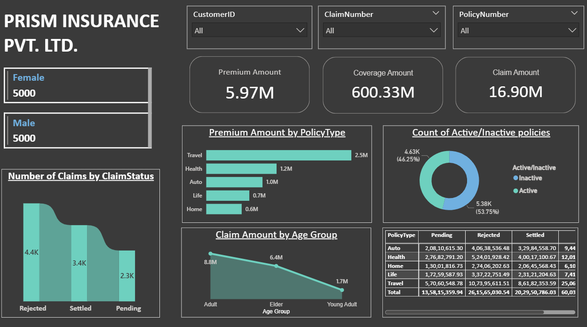

# 📊 Insurance Data – Power BI Report

This repository contains a **Power BI dashboard** created using a small insurance dataset.  
The report provides insights into **policy types, claims, premium amounts, coverage amounts, and customer demographics**.  

---

## 🖼️ Dashboard Preview  

---

## 📌 Features  

- Gender-wise customer distribution  
- Premium, coverage, and claim amount analysis  
- Number of claims by **status (Pending, Settled, Rejected)**  
- Premium distribution by **policy type** (Health, Auto, Travel, etc.)  
- Count of **active vs inactive policies**  
- Claim amount analysis by **age group**  
- Tabular view of claims across different policy types  

---

## 🛠️ Tools & Technologies  

- **Power BI Desktop**  
- Dataset: Insurance data (sample)  

